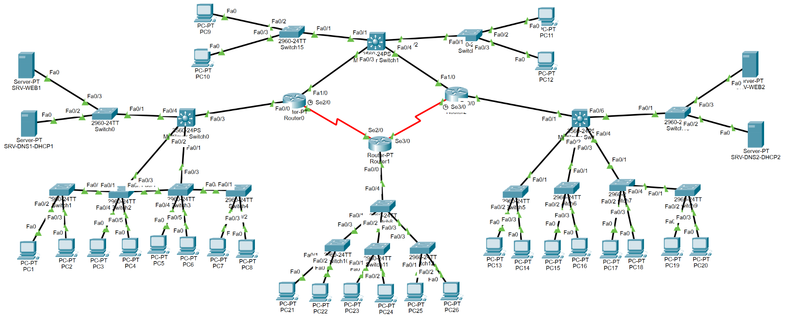

# Cisco Network Lab (Packet Tracer)
Network simulation project using Cisco Packet Tracer including VLAN, inter-VLAN routing, DHCP, ACL and RIP configuration

# Multi-Site Network Simulation (Cisco Packet Tracer)

## Description
This project is a multi-site network simulation created using Cisco Packet Tracer.

The network includes multiple locations (Montreal, Ottawa, Toronto, Quebec) and implements VLAN segmentation, inter-VLAN routing, DHCP, DNS and RIP protocol for routing between sites.

## Description (Français)
Ce projet est une simulation de réseau multi-sites réalisée avec Cisco Packet Tracer.

## Technologies Used
- VLAN (multiple departments per site)
- Inter-VLAN Routing (Layer 3 Switch)
- RIP v2 (routing between sites)
- DHCP (automatic IP assignment)
- DNS (web access resolution)
- ACL (access control between VLANs)

## Network Design
- Multiple sites connected via routers
- Each site contains multiple VLANs (Marketing, Production, Servers)
- Layer 3 switches used for routing within sites
- Routers used for inter-site communication

## Key Features
- VLAN segmentation by department
- Inter-VLAN communication within each site
- Dynamic routing between sites using RIP
- DHCP configured for automatic IP assignment
- DNS configured for internal web servers
- ACL rules applied to control access between VLANs

## Access Control (ACL)
- Restricted access to specific web servers based on VLAN
- Limited ping access between marketing and server VLANs
- Specific exceptions allowed for selected hosts
- Default rule allows all other traffic

## Result
- Successful communication between all sites
- VLAN isolation correctly implemented
- Routing verified using ping tests
- Access control rules tested and validated

## Network Topology

## How to open
Open the .pkt file using Cisco Packet Tracer to explore the full network configuration.

## Note
This project was completed as part of a networking course and received a full score (100%).
