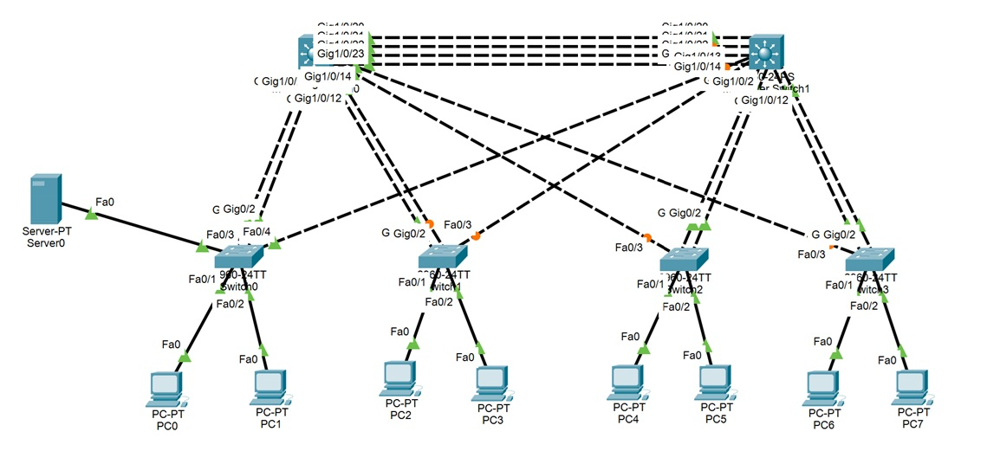

# Cisco Network Lab - EtherChannel, VLAN, DHCP and HSRP

Enterprise network simulation created using Cisco Packet Tracer.

This project focuses on network redundancy, high availability and fault tolerance through the implementation of VLAN segmentation, EtherChannel link aggregation and HSRP gateway redundancy.

## Overview

The objective of this laboratory was to design a resilient enterprise network capable of maintaining connectivity even during link or device failures.

The project combines:

- VLAN segmentation
- Inter-VLAN routing
- DHCP services
- EtherChannel
- HSRP
- STP (Spanning Tree Protocol)

to provide a highly available network architecture.

## Technologies Used

- VLAN
- Inter-VLAN Routing
- EtherChannel
- DHCP
- HSRP
- STP (Spanning Tree Protocol)
- Layer 2 Switching
- Layer 3 Switching

## Network Design

### VLAN Structure

| VLAN | Purpose | Network |
|--------|---------|---------|
| VLAN 10 | Users | 10.10.0.0/24 |
| VLAN 20 | Users | 10.20.0.0/24 |
| VLAN 30 | Users | 10.30.0.0/24 |
| VLAN 40 | Servers / DHCP | 10.40.0.0/24 |

### Device Architecture

- 2 Layer 3 switches
- 4 Access Layer switches
- 1 DHCP Server
- Multiple client PCs
- Redundant uplinks between access and distribution layers

The topology is designed to eliminate single points of failure.

## EtherChannel Implementation

Multiple physical links between switches were aggregated into logical Port-Channels.

### Benefits

- Increased bandwidth
- Load distribution
- Link redundancy
- Automatic failover

If one physical link fails, traffic continues through the remaining active links without service interruption.

## HSRP Configuration

HSRP (Hot Standby Router Protocol) was implemented on the Layer 3 switches to provide gateway redundancy.

### Layer 3 Switch Addresses

#### L3 Switch 1

| VLAN | Address |
|--------|---------|
| VLAN 10 | 10.10.0.1 |
| VLAN 20 | 10.20.0.1 |
| VLAN 30 | 10.30.0.1 |

#### L3 Switch 2

| VLAN | Address |
|--------|---------|
| VLAN 10 | 10.10.0.2 |
| VLAN 20 | 10.20.0.2 |
| VLAN 30 | 10.30.0.2 |

### Virtual Gateway Addresses

| VLAN | Virtual Gateway |
|--------|---------|
| VLAN 10 | 10.10.0.3 |
| VLAN 20 | 10.20.0.3 |
| VLAN 30 | 10.30.0.3 |

### Priority Configuration

| Device | Priority |
|---------|----------|
| L3 Switch 1 | 110 |
| L3 Switch 2 | 90 |

L3 Switch 1 operates as the Active Router while L3 Switch 2 remains in Standby mode.

If the Active Router fails, the Standby Router automatically takes over gateway responsibilities.

## STP Operation

Because the network contains redundant paths, STP was required to prevent switching loops.

STP automatically blocks selected ports while maintaining backup paths.

This prevents:

- Broadcast storms
- ARP storms
- MAC address table instability

while still preserving redundancy.

## Validation Tests

### EtherChannel Test

A physical link within the EtherChannel bundle was manually disabled.

Result:

- Network remained operational
- Traffic continued through remaining links
- Connectivity between hosts was maintained
- Available bandwidth decreased but service remained active

After restoring the link:

- Port automatically rejoined the EtherChannel
- Full bandwidth was restored
- Normal operation resumed

### HSRP Failover Test

The Active Layer 3 Switch was intentionally disabled.

Result:

- Standby Layer 3 Switch became Active
- Default gateway remained available
- Client communication continued without manual intervention

This verified successful gateway redundancy.

## Results

Successfully implemented:

- VLAN segmentation
- Inter-VLAN routing
- DHCP address assignment
- EtherChannel aggregation
- STP loop prevention
- HSRP gateway redundancy

All hosts were able to communicate as expected and failover mechanisms operated correctly during testing.

## Network Topology

## How to Open

Open the `.pkt` file using Cisco Packet Tracer.

## Note

This project was completed as part of a networking laboratory and successfully validated link redundancy, gateway redundancy and fault-tolerant network design concepts.
